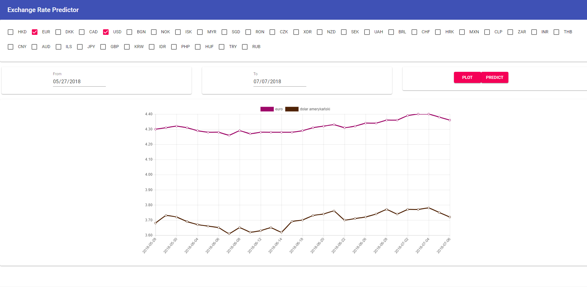

# exchange-rate-predictor

Exchange Rate visualizing and predicting application using data from [NBP api](http://api.nbp.pl/).

## How to install and start

Clone this repository first.

### Docker image
Application can be run as a docker image:

1. Go to __docker__ folder and execute script `./build.sh`. This will create docker image called *exchange-rate-predictor*.
2. Create a new docker container:
    ```
    docker run -p 8080:80 exchange-rate-predictor:latest
    ```

### Java JAR file
1. Build project using `./gradlew clean build`.
2. Start the JAR file of the __api__ project:
    ```
    java -jar -Dserver.port=SERVER_PORT -Dnbp.import-from=2018-01-01 api/build/libs/api-1.0.jar
    ```

After starting the application, visit http://localhost:8080/index.html.

## How to use

Application will preload data from table __A__ from __nbp.import-from__ (by default 2018-01-01) to current date, from the NBP api.
It allows to plot exchange rates for selected currencies from a given time period, and to plot predicted values for the next week.




## License
```
MIT License

Copyright (c) 2018 Maciej Grzeszczak

Permission is hereby granted, free of charge, to any person obtaining a copy
of this software and associated documentation files (the "Software"), to deal
in the Software without restriction, including without limitation the rights
to use, copy, modify, merge, publish, distribute, sublicense, and/or sell
copies of the Software, and to permit persons to whom the Software is
furnished to do so, subject to the following conditions:

The above copyright notice and this permission notice shall be included in all
copies or substantial portions of the Software.

THE SOFTWARE IS PROVIDED "AS IS", WITHOUT WARRANTY OF ANY KIND, EXPRESS OR
IMPLIED, INCLUDING BUT NOT LIMITED TO THE WARRANTIES OF MERCHANTABILITY,
FITNESS FOR A PARTICULAR PURPOSE AND NONINFRINGEMENT. IN NO EVENT SHALL THE
AUTHORS OR COPYRIGHT HOLDERS BE LIABLE FOR ANY CLAIM, DAMAGES OR OTHER
LIABILITY, WHETHER IN AN ACTION OF CONTRACT, TORT OR OTHERWISE, ARISING FROM,
OUT OF OR IN CONNECTION WITH THE SOFTWARE OR THE USE OR OTHER DEALINGS IN THE
SOFTWARE.
```